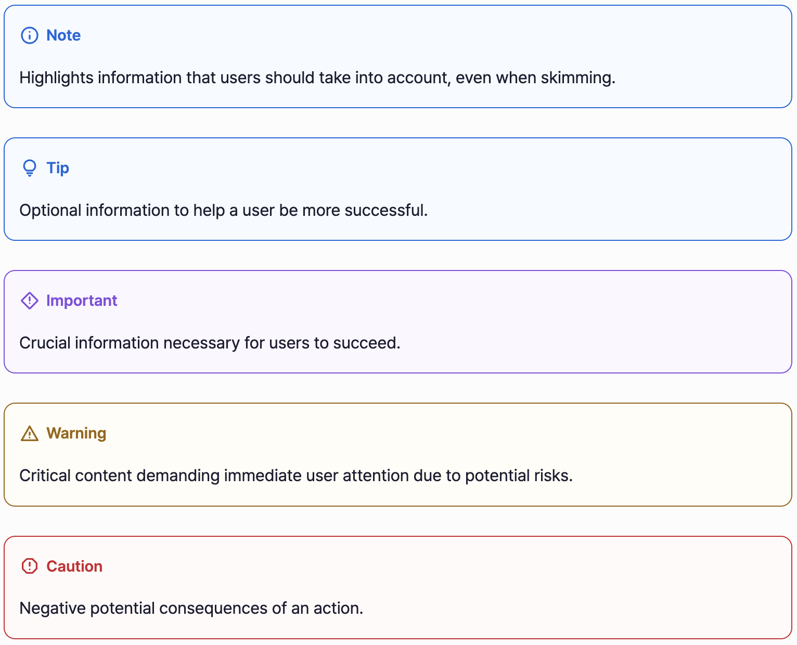

# remark-blockquote-highlights


`remark-blockquote-highlights` extends the functionality of Markdown to enable highlighted blockquotes in environments
using `remark`, such as [Gatsby.js](https://gatsbyjs.com/) and similar frameworks. By default, Markdown in these
environments does not support
blockquote highlights.

This package supports [ESM](https://nodejs.org/api/esm.html) and [CommonJS](https://nodejs.org/api/modules.html)
formats, ensuring compatibility with modern frameworks and Node.js environments.

GitHub introduced this feature in 2022 (see [GitHub Discussions](https://github.com/orgs/community/discussions/16925)),
and it has since been widely used in many documents. This library allows you to bring similar functionality to your
Markdown-based projects.

## How It Works

This library transforms blockquote prefixes into CSS class formats. For example, a blockquote starting with `[!NOTE]`
will be converted to `class="blockquote-note"`. Using CSS, you can style these blockquotes to create elegant components
like the example below:

**An example of all five types:**

```markdown
> [!NOTE]
> Highlights information that users should take into account, even when skimming.

> [!TIP]
> Optional information to help a user be more successful.

> [!IMPORTANT]
> Crucial information necessary for users to succeed.

> [!WARNING]
> Critical content demanding immediate user attention due to potential risks.

> [!CAUTION]
> Negative potential consequences of an action.
```

**Here is how they are displayed:**

<picture>
  <source media="(prefers-color-scheme: dark)" srcset="./docs/blockquote-sample-dark.png">
  
</picture>

## Installation

```bash
npm install remark-blockquote-highlights
```

You can also install using [pnpm](https://pnpm.io/) or [yarn](https://yarnpkg.com/).

## Usage

### Basic Usage

```typescript
import remarkHighlight from 'remark-blockquote-highlights';

const markdown = '> [!NOTE] Highlights information that users should take into account, even when skimming.';

const result = remark()
  .use(remarkHighlight)
  .use(remarkRehype)
  .use(rehypeStringify)
  .processSync(markdown).toString();
```

This output will be:

```html

<blockquote class="blockquote-note">
  <p>Highlights information that users should take into account, even when skimming.</p>
</blockquote>
```

### Using with Gatsby.js

To use `remark-blockquote-highlights` in a `Gatsby.js` project, you can integrate it with `gatsby-plugin-mdx` by
extending its Remark plugins configuration.

```typescript
// gatsby-config.js

import remarkHighlight from 'remark-blockquote-highlights';

const config: GatsbyConfig = {
  plugins: [
    {
      resolve: 'gatsby-plugin-mdx',
      options: {
        mdxOptions: {
          remarkPlugins: [remarkHighlight],
        },
      },
    },
  ],
};
```

## Styling

To apply the default styles shown in the examples, simply import:

```typescript
import "remark-blockquote-highlights/styles/blockquote.min.css";
```

If you'd like to customize the styles, you can copy and modify the file:

```text
remark-blockquote-highlights/styles/blockquote.css
```

## Contributing

We welcome all contributions! You can [open an issue](../issues) to report bugs or suggest features, and [submit a pull request](../pulls) to contribute directly to the codebase.

## License

This project is distributed under the MIT License. For more information, see the [LICENSE](./LICENSE) file.

## Contact

If you have any questions, feel free to reach out via [Issues](../issues) or contact me directly at [me@haklee.me](mailto:me@haklee.me).
